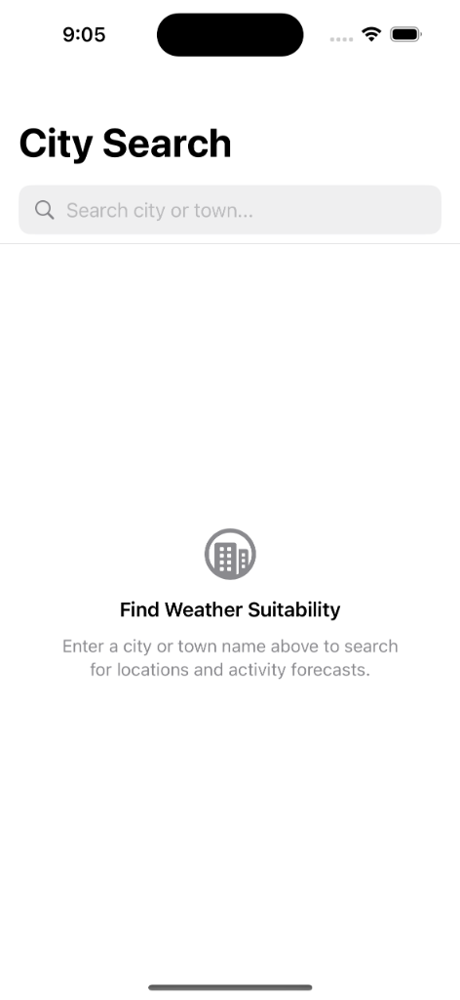
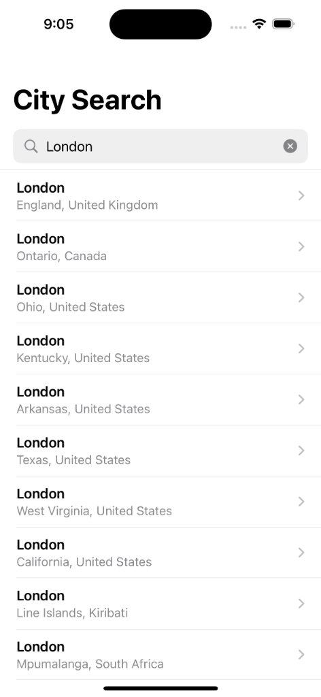
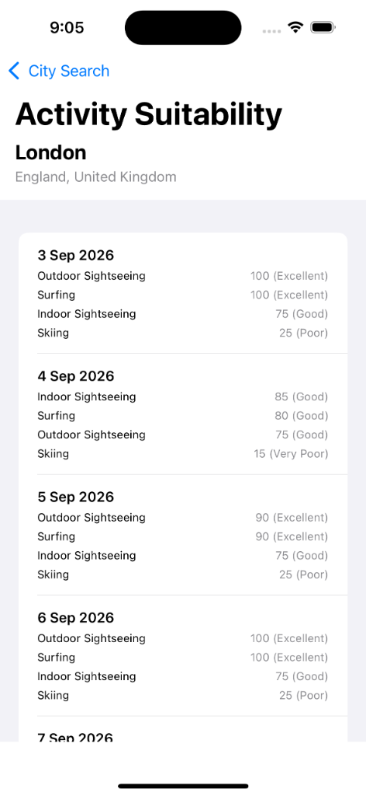

# ActivityForecaster

A native iOS application built with **Swift and SwiftUI** that allows users to search for cities or towns and evaluate weather suitability for four popular activities over the next 7 days:

* ⛷️ **Skiing**
* 🏄 **Surfing**
* 🏛️ **Outdoor Sightseeing**
* 🖼️ **Indoor Sightseeing**

The application integrates with the **Open-Meteo Geocoding API** for location search and the **Open-Meteo Forecast API** for 7-day daily weather forecasts. Weather data is processed locally by a rule-based suitability engine that ranks activities deterministically for each day.

---

## Features

### 🔍 City & Town Search
- Search-as-you-type interface powered by the Open-Meteo Geocoding API.
- Debounced search queries (300 ms) to reduce unnecessary network traffic.
- Automatic task cancellation of in-flight network requests when typing continues.
- Robust handling of loading, empty result, and error states.

### 📅 7-Day Weather Forecast
- Retrieves 7-day daily weather parameters including max/min temperatures, precipitation totals, snowfall totals, max wind speeds, and weather codes.
- Isolated mapping between API network response models and domain forecast entities.

### 🎯 Activity Suitability Scoring & Ranking
- Independent scoring of weather conditions for Skiing, Surfing, Outdoor Sightseeing, and Indoor Sightseeing.
- Normalizes raw suitability scores to a standardized **0–100** range.
- Maps scores to a 5-tier human-readable rating scale (**Excellent**, **Good**, **Fair**, **Poor**, **Very Poor**).
- Ranks activities per day in descending order of suitability with deterministic alphabetical tie-breaking.

---

## Screenshots

<div align="center">

| City Search (Idle) | Search Results | 7-Day Activity Forecast |
| :---: | :---: | :---: |
|  |  |  |

</div>

---

## Technology Stack

- **Platform**: iOS 18.0+
- **Language**: Swift 6
- **UI Framework**: SwiftUI
- **Architecture**: Model-View-ViewModel (MVVM) + Clean Domain Layer
- **Concurrency**: Swift Concurrency (`async/await`, `@MainActor`, `Task`)
- **Networking**: `URLSession` with `Codable` JSON decoding
- **Testing**: XCTest (Unit Tests, Mock Protocol Networking, UI Automation)
- **External API**: Open-Meteo Geocoding & Weather Forecast APIs (Free Tier, No API Key required)

---

## Architecture

The project strictly follows MVVM and Clean Architecture principles with clear layer separation and unidirectional dependency flow:

```text
       ┌──────────────────────────────────────────────┐
       │                 SwiftUI Views                │
       │   (CitySearchView, ForecastView, Rows, etc.) │
       └──────────────────────┬───────────────────────┘
                              │
                              ▼
       ┌──────────────────────────────────────────────┐
       │                  ViewModels                  │
       │     (@MainActor state & task management)     │
       └──────────────────────┬───────────────────────┘
                              │
               ┌──────────────┴──────────────┐
               ▼                             ▼
    ┌────────────────────┐        ┌────────────────────┐
    │  Services Layer    │        │    Domain Layer    │
    │ (Geocoding/Forecast│        │ (SuitabilityEngine,│
    │    Services)       │        │   Scoring Rules)   │
    └──────────┬─────────┘        └────────────────────┘
               │
               ▼
    ┌────────────────────┐
    │   Networking Core  │
    │(URLSessionHTTPClient)│
    └────────────────────┘
```

### Layer Responsibilities

- **`Core/`**: Protocol abstractions (`HTTPClientProtocol`), concrete `URLSessionHTTPClient`, and custom `NetworkError` types.
- **`Data/`**: API response DTOs (`GeocodingResponse`, `ForecastResponse`) and pure data mappers (`GeocodingMapper`, `ForecastMapper`) converting DTOs into domain models.
- **`Domain/`**: Pure domain entities (`Location`, `Forecast`, `DailyForecast`, `SuitabilityResult`, `Rating`), `SuitabilityEngine`, and strategy-based scoring rules (`ActivityScoringRule`). Domain layer has zero dependencies on SwiftUI or networking frameworks.
- **`Services/`**: High-level application service protocols (`GeocodingServiceProtocol`, `ForecastServiceProtocol`) and Open-Meteo implementations.
- **`Features/`**: SwiftUI views, subviews, and `@MainActor` isolated ViewModels (`CitySearchViewModel`, `ForecastViewModel`).
- **`Tests/`**: Complete suite of unit tests, mapper tests, mock protocol networking tests, and UI automation tests.

---

## Data Flow

Data flows strictly in one direction from raw network JSON to UI presentation:

```text
Open-Meteo JSON
      │
      ▼
GeocodingResponse / ForecastResponse  (API DTOs)
      │
      ▼ (GeocodingMapper / ForecastMapper)
Location / Forecast                   (Domain Entities)
      │
      ▼ (SuitabilityEngine)
SuitabilityResult                     (Scores & Ratings)
      │
      ▼ (ViewModels @MainActor)
DailySuitability / State              (UI State)
      │
      ▼
SwiftUI View Rendering
```

API response DTOs are decoupled from Domain entities to isolate external API schema changes from application logic.

---

## Suitability Engine & Scoring Rules

The `SuitabilityEngine` evaluates a 7-day forecast by delegating calculation to individual `ActivityScoringRule` implementations.

### Rating Scale

Raw suitability scores are normalized and clamped between `0` and `100`, then categorized into a 5-tier rating system:

| Score Range | Rating |
| :--- | :--- |
| **90 – 100** | **Excellent** |
| **75 – 89** | **Good** |
| **50 – 74** | **Fair** |
| **25 – 49** | **Poor** |
| **0 – 24** | **Very Poor** |

### Activity Scoring Factors & Weights

#### ⛷️ Skiing (`SkiingScoringRule`)
- **Snowfall (40%)**: >10 cm (+40), >5 cm (+30), >0 cm (+15), 0 cm (+0).
- **Temperature (30%)**: ≤0°C (+30), ≤3°C (+15), ≤6°C (+5), >6°C (+0).
- **Wind Speed (15%)**: ≤20 km/h (+15), ≤40 km/h (+5), >40 km/h (-10 penalty).
- **Weather Code (10%)**: Snow codes (71, 73, 75, 77, 85, 86) -> +10.
- **Rain Penalty (5%)**: >5 mm (-30 penalty), >0 mm (-15 penalty).

#### 🏄 Surfing (`SurfingScoringRule`)
- **Wind Speed (35%)**: 15–30 km/h (+35 optimal breeze), 10–14 or 31–40 km/h (+20), 5–9 or 41–50 km/h (+10).
- **Weather Code (25%)**: Severe thunderstorms (95, 96, 99) cap score at **10**. Clear/partly cloudy (0, 1, 2, 3) -> +25, Fog/drizzle -> +15, Rain -> +10.
- **Precipitation (20%)**: ≤2 mm (+20), ≤10 mm (+10), >10 mm (+0).
- **Air Temperature (20%)**: 18–28°C (+20), 12–17°C or 29–33°C (+10), else (+5).

#### 🏛️ Outdoor Sightseeing (`OutdoorSightseeingScoringRule`)
- **Temperature (35%)**: 18–26°C (+45), 12–17°C or 27–30°C (+35), 5–11°C or 31–35°C (+20), else (+5).
- **Precipitation (35%)**: 0 mm (+40), ≤2 mm (+25), ≤10 mm (+10), >10 mm (-20 penalty).
- **Weather Code (20%)**: Severe thunderstorms (95, 96, 99) cap score at **10**. Clear sky (0, 1, 2) bonus -> +10.
- **Wind Speed (10%)**: ≤20 km/h (+15), ≤35 km/h (+5), >35 km/h (-15 penalty).

#### 🖼️ Indoor Sightseeing (`IndoorSightseeingScoringRule`)
- **Precipitation (40%)**: >10 mm (+40 rainy weather enhances indoor appeal), 2.1–10 mm (+30), 0.1–2.0 mm (+20), 0 mm (+10).
- **Temperature (25%)**: Extreme cold/heat (<5°C or >32°C) (+25), moderate cold/warm (5–11°C or 27–32°C) (+20), mild (+15).
- **Weather Code (25%)**: Rain/snow/thunder codes -> +25, else -> +10.
- **Wind Speed (10%)**: >35 km/h (+10), ≤35 km/h (+5).

---

## 7-Day Forecast Evaluation & Surfing Limitation

### 7-Day Daily Ranking
The application evaluates weather suitability on a **per-day basis** for all 7 days of the forecast horizon. For each date, activities are scored individually and presented in ranked order. Tied scores are sorted alphabetically by activity name for deterministic ordering.

### ⚠️ Surfing Evaluation Limitation Note
The Open-Meteo weather forecast API provides atmospheric data (wind speed, temperature, precipitation, weather code) but does not provide marine oceanographic data such as wave height, swell direction, wave period, or tides. The surfing score represents **weather suitability for surfing** rather than comprehensive ocean surf conditions.

---

## External API Integration

The application uses Open-Meteo public endpoints (free tier, no API key required):

1. **Geocoding API**: `https://geocoding-api.open-meteo.com/v1/search`
   - Parameters: `name`, `count` (10), `language` (en), `format` (json).
2. **Forecast API**: `https://api.open-meteo.com/v1/forecast`
   - Parameters: `latitude`, `longitude`, `daily` (`temperature_2m_max`, `temperature_2m_min`, `precipitation_sum`, `snowfall_sum`, `wind_speed_10m_max`, `weather_code`), `timezone` (auto).

---

## Setup & Running the Project

### Requirements
- **Xcode 16.0+**
- **iOS 18.0+ Simulator or Device**
- **macOS Sequoia or later**

### Steps
1. Clone or download the repository:
   ```bash
   git clone https://github.com/sagar9327/ActivityForecaster.git
   cd ActivityForecaster/Untitled
   ```
2. Open `ActivityForecaster.xcodeproj` in Xcode.
3. Select the `ActivityForecaster` scheme and an iOS 18+ simulator target (e.g. iPhone 16).
4. Press `Cmd + R` to build and run the application.
5. Press `Cmd + U` to execute the full unit and UI test suite.

---

## Testing Strategy

The project features comprehensive automated test coverage with **zero live network calls** in unit tests:

- **Domain Scoring Tests**: Exhaustive boundary tests verifying score calculations and clamping (0 and 100) for all scoring rules.
- **Mapper & Parsing Tests**: ISO8601 date parsing, parallel response array mismatch handling, and nil optional field fallback tests.
- **Networking Tests**: `URLSessionHTTPClientTests` utilizing `MockURLProtocol` to test 200 OK, non-2xx HTTP status codes, empty data, malformed JSON, and offline network failures.
- **ViewModel Tests**: Search query debouncing, task cancellation, stale response protection, error propagation, and state transitions.
- **UI Automation Tests**: Navigation bar verification, text field entry, clear button interaction, and launch performance monitoring.

---

## Technical Decisions & Trade-offs

- **SwiftUI + MVVM**: Provides declarative UI state binding while keeping business logic and ViewModels cleanly testable.
- **Swift Concurrency (`async/await`)**: Replaces completion handlers and DispatchQueues with structured concurrency and native task cancellation.
- **Native `URLSession`**: Keeps the project lightweight and dependency-free without third-party networking libraries.
- **Rule-Based Engine**: Scoring rules implement the `ActivityScoringRule` protocol. Adding a fifth activity requires creating one new rule file without modifying existing UI or engine code.
- **Thread-Safe DateFormatter Caching**: Reuses a static `DateFormatter` instance to prevent expensive allocations during list rendering.

---

## AI-Assisted Development Transparency

AI assistance was utilized during development as an interactive pair-programming assistant under explicit developer guidance:

- **Prompt Engineering**: Prompts were structured by development phases (Phases 1–10) with explicit architectural constraints.
- **Developer Review**: All AI-generated suggestions, scoring rules, algorithms, and concurrency mechanisms were reviewed and validated by the developer.
- **Automated Verification**: Implementation decisions were validated by running unit tests (`xcodebuild test`) after every change to enforce regression safety.

---

## License

This project is open source and available under the terms of the MIT License.
